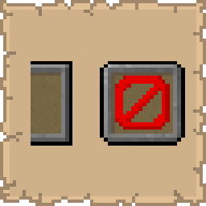

# Tenth Slot

## Installation

* [Modrinth](https://modrinth.com/mod/tenth-slot)
* [CurseForge](https://www.curseforge.com/minecraft/mc-mods/tenth-slot)

## Support
  
If you encounter bugs or wish to contribute:
* [Report any problems you find.](https://github.com/armaninyow/Tenth-Slot/discussions/categories/issues)
* [Share your ideas for new features.](https://github.com/armaninyow/Tenth-Slot/discussions/categories/suggestions)

## Changelog

  

  
### 2.1.0—26.x
* Added support for Minecraft 26.2
### 2.0.1—26.x
* Fixed tenth slot appearing in spectator mode
* Fixed health, hunger, XP bar, and other survival HUD elements being hidden when the tenth slot was selected
### 2.0.0—26.x
* Added support for Minecraft 26.1, 26.1.1, and 26.1.2
* Replaced Cloth Config with YetAnotherConfigLib (YACL) 3.9.3 for the in-game config screen
### 1.0.1—1.21.x
* Fixed the inverted scroll direction in 1.21 and 1.21.1
### 1.0.0—1.21.x
* Initial Release

